# SysY 编译器设计文档

## 一. 参考编译器介绍

参考项目：TrivalCompiler

[trivalcompiler]: https://github.com/TrivialCompiler/TrivialCompiler.git

### 总体结构

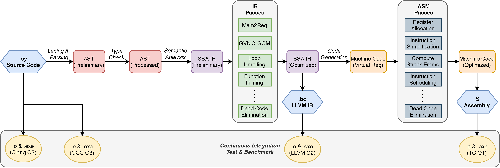

如上图所示，TrivalCompiler 这个项目采用的是前、中、后三端的架构形式。前端采用的 Parser 采用作者自己编写的 Parser Generator lalr1 自动生成。 lalr1 内部调用 re2dfa2 生成 lexer。经过语义分析后生成半 SSA 的 IR 形式。经过 IR 的中间优化 Passes 之后，称为优化后的真正的 SSA 形式的 IR。此时导出的 LLVM IR 可以被 LLVM 虚拟机直接执行。

根据 IR，后端一比一将 LLVM IR 转换为 ARM v7-A，并通过第二次的后端优化 Passes 最终得到.S 的 ARM v7-A 的目标代码输出。

### 文件组织

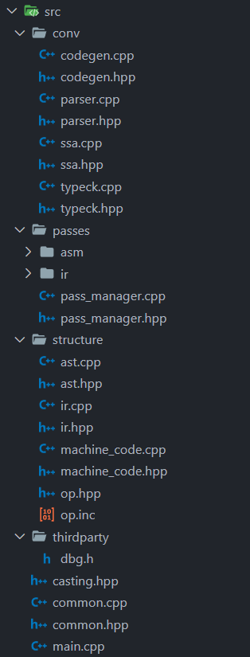

文件结构如上图：主要有三个部分 conv 中为前端 Parser 和中后端的脚手架代码；structure 中为编译器中的主要数据结构如 IR 和机器码的结构设计；passes 中包含的是中端、后端的优化 passes。

## 二. 编译器总体设计

### 编译器的总体结构

本课程实现的编译器 BUAA-Compile-SysY 的总体架构分为前端、中端、后端三端。其中中端与后端所执行的任务为传统意义上的后端部分，将前端分析的抽象语法树转换为代码。这里区分中端的原因在于本编译器将导出的中间代码输出为 LLVM IR，并在其上做单独的优化后再由后端转换为对应的 MIPS 目标代码，与传统的语法制导翻译的流程有较大的区别。

前端：由 Tokenizer 和 Parser 构成

- Tokenizer：将源码文本字符序列转换为 Token 流
- Parser：将 Token 流转换为 AST

中端：由 CodeGenerator、Visitor、中端的优化 Passes 以及 IR 的数据结构构成

- CodeGenerator：代码生成的脚手架，执行代码生成和优化的流程
- Visitor：从根节点深度优先遍历整棵语法树，导出 LLVM IR 代码
- IR 数据结构：参考 LLVM 的实现自己设计的一套数据结构，详情见代码生成设计一章。

后端：由 CodeGenerator、Converter、后端的优化 Passes 以及 MipsCode 的数据结构构成

- CodeGenerator：代码生成的脚手架，执行代码生成和优化的流程
- Converter：从 Visitor 导出的 IR 序列，逐指令将 IR 序列转换为 MIPSCode 序列
- MipsCode 数据结构：对应 IR 数据结构针对 Mips 体系结构设计的数据结构

其他：

- SymbolTable 符号表：栈式符号表用于编译期间的符号表管理
- ErrorLogger 错误处理：发生错误将根据指令输出到对应的文件中，并直接将具体错误信息输出到控制台

### 接口设计

```
usage: sysyc [--dump-token <path>] [--dump-ast <path>] [--dump-table <path>] [--dump-error <path>] [--dump-ir <path>] [--dump-mips <path>] [ -o <path> ] [ -O['0','1'] ]<path>
```

- --dump-token:导出 token 序列到`<path>`文件中。
- --dump-ast:导出抽象语法树到`<path>`文件中。
- --dump-table:导出符号表到`<path>`文件中。
- --dump-error:导出错误序号到`<path>`文件中。
- --dump-ir:导出 LLVM IR 到`<path>`文件中。
- --dump-mips:导出 mips 汇编到`<path>`文件中。
- -o: 输出结构到`<path>`文件中。（与 dump-mips 相同）
- -O：指定优化等级，0 为不优化，1 以上为开启优化
- 接受一个直接参数为输入的文件名称

### 文件组织

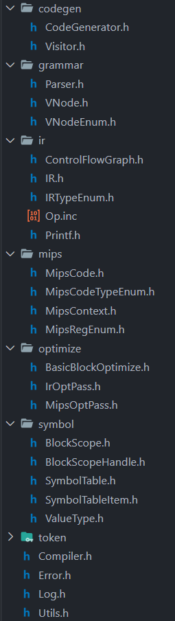

上图为头文件的结构布局，分为 codegen、grammar、ir、mips、optimize、symbol、token 共 7 个部分。

- codegen：中间与目标代码生成、优化代码的脚手架部分。
- grammar：语法分析递归下降子程序部分
- ir：LLVM IR 的中间代码数据结构
- mips：MipsCode 的目标代码数据结构以及转换
- optimize：优化的 Passes，分为中端的 IrOptPass 和后端的 MipsOptPass
- symbol：栈式符号表以及符号表项的数据结构设计、类型的设计
- token：Tokenizer 部分

## 三. 词法分析设计

### 编码前的设计

|                  |            |          |          |          |        |          |         |
| ---------------- | ---------- | -------- | -------- | -------- | ------ | -------- | ------- |
| 单词名称         | 类别码     | 单词名称 | 类别码   | 单词名称 | 类别码 | 单词名称 | 类别码  |
| **Ident**        | IDENFR     | !        | NOT      | \*       | MULT   | =        | ASSIGN  |
| **IntConst**     | INTCON     | &&       | AND      | /        | DIV    | ;        | SEMICN  |
| **FormatString** | STRCON     | \|\|     | OR       | %        | MOD    | ,        | COMMA   |
| main             | MAINTK     | while    | WHILETK  | <        | LSS    | (        | LPARENT |
| const            | CONSTTK    | getint   | GETINTTK | <=       | LEQ    | )        | RPARENT |
| int              | INTTK      | printf   | PRINTFTK | >        | GRE    | [        | LBRACK  |
| break            | BREAKTK    | return   | RETURNTK | >=       | GEQ    | ]        | RBRACK  |
| continue         | CONTINUETK | +        | PLUS     | ==       | EQL    | {        | LBRACE  |
| if               | IFTK       | -        | MINU     | !=       | NEQ    | }        | RBRACE  |
| else             | ELSETK     | void     | VOIDTK   |          |        |          |         |

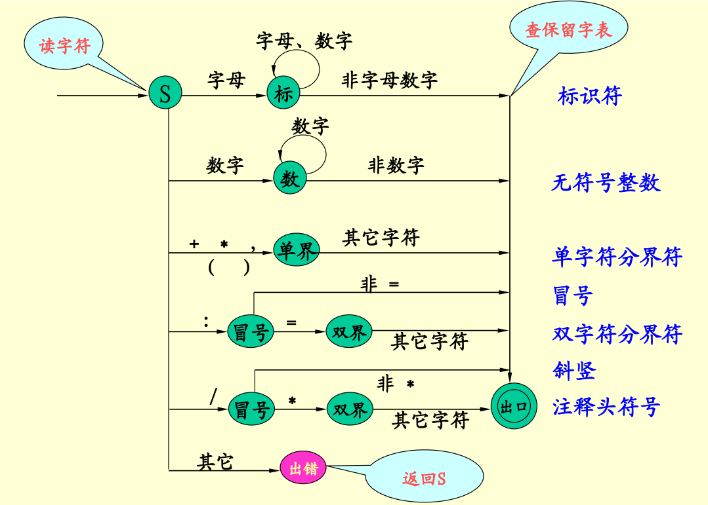

如上图所示，采用自动机的状态图来识别词法。从 S 状态读入有一下几种可能：

1. 处理标识符
2. 处理非零数字
3. 处理注释和除法
4. 处理分界符号
5. 处理字面量字符串

分别编写对应的函数应对不同的情况即可。

### 编码完成之后的修改

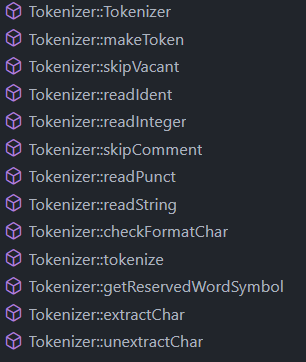

上图是编码完成后的函数大纲。

## 四. 语法分析设计

### 编码前的设计

语法分析采用递归下降子程序读入词法分析的 Token 流序列，输出 AST 语法树。每次递归调用都返回一个 AST 树节点作为非终结符所对应的语法成分，由此一层层组成一棵树语法树。

AST 树节点的设计采用的是非终结符和终结符分别对应 VNodeBranch 和 VNodeLeaf 两个类，两者泛化自 VNodeBase，以 VNodeBase 为基础元素构成 AST 树。

核心类 Parser 中，每个非终结符对应一个同名函数作为子程序，嵌套递归调用结束返回一个`shared_ptr<VNodeBase>`作为结果，再依次被呈递上层的子程序，直到 compUnit，如下图所示。

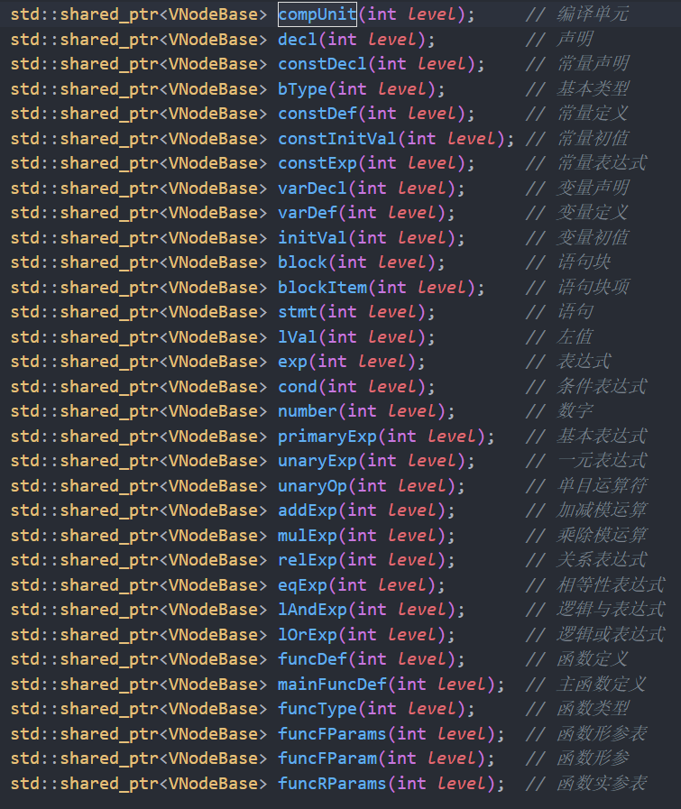

值得注意其中的左递归文法将被改写为 EBNF 文法，如 AddExp := MulExp | AddExp ('+' | '-') MulExp 改写 AddExp := MulExp {('+'|'-') MulExp}。

### 编码完成之后的修改

大部分情况下递归下降判断调用某个语法成分在 token 流的一定位置下，只要预读一个 token 即可，选择是唯一的。但是在 exp、funcRParams、Assignment 三种情况下，需要预读多个语法成分才能得知该调用哪个子程序。因此分别用以下三个函数判断是否为 exp、funcRParams、Assignment

- bool expectAssignment();
- bool expectPureExp();
- bool expectUnaryOp();
- bool expectFuncRParams();

在函数中可以重复使用子程序进行程序的预读，不过在预读之时是不能记录符号表和构建树的。因此需要一个全局的变量表示出于预读状态，在进入 expectXXX()函数时开启，退出时结束。在预读状态下，符号表并不记录符号，且子程序并不产生 AST 树的节点。

## 五. 错误处理设计

### 编码前的设计

#### 符号表的设计

符号表与采用栈式符号表的设计。符号表将维护一个 Scope 栈。每个 Scope 代表由大括号括起的内部的语句成分。在设计操作中，我们并不直接操作 Scope 栈中栈帧本身，而是操作其 Scope 的句柄实现符号栈的入栈和出栈。

每个 Scope 保存其父 Scope 和子 Scope 的句柄、Scope 的层级、Scope 的类型、Scope 中包含的符号以及函数。

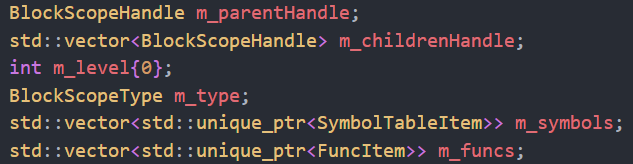

Scope 一共有五种类型：Normal 表示一般的大括号包含的语句块，Func 代表函数大括号下所有语句块、Global 为所有 Scope 的父 Scope、Branch 代表 if/else 的 stmt 所在的语句块、Loop 代表 while 的 stmt 坐在的语句块。

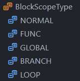

我们认为低层的 Scope 中变量将全部暴露给高层中代码使用，高层的 Scope 中同名变量会覆盖低层中的变量。一个典型的查找符号表的过程为：如果当前 Scope 中查找到对应的符号则直接返回，如果没找到则在其父 Scope 中查找，依此类推，直到查找到 Global Scope 仍未找到，则认为符号表中没有对应的符号。

#### 错误类型与检查逻辑

- a 非法符号：在解析到 FormatString 类型的词法元素后检查
- b 名字重定义：从子程序记录位置向后遍历符号表检查名字是否已存在
- c 未定义的名字：从符号表末尾向前遍历至头部检查名字是否存在
- d 函数参数个数不匹配：检查到调用函数语句后到符号表中查到函数定义，比照实参列表与形参列表的参数个数（此部分可以和 e 错误同时进行）
- e 函数参数类型不匹配：检查到调用函数语句后到符号表中查到函数定义，比照实参列表与形参列表对应位置的参数类型（此部分可以和 d 错误同时进行），注意参数可能是函数调用
- f 无返回值的函数存在不匹配的 return 语句：在全局维护一个函数类型变量，若当前处于函数定义部分的解析用于记录函数期望的返回值，当遇到 return 语句时检查返回值有无与此变量是否匹配
- g 有返回值的函数缺少 return 语句：在全局维护一个函数类型变量，维护一个标识是否有 return 语句的 boolean 值，函数解析进入前置位 false，期间解析到 return 语句则置为 true，函数解析结束后检查此标识并报错
- h 不能改变常量的值：解析到赋值语句后到符号表从后往前根据名字查找符号并检查符号类型
- i 缺少分号：按照语法定义同步检查
- j 缺少右小括号：按照语法定义同步检查
- k 缺少右中括号：按照语法定义同步检查
- l printf 中格式字符与表达式个数不匹配：解析到 printf 语法后比较待 print 字符串中占位符个数与待 print 元素个数
- m 在非循环块中使用 break 和 continue 语句：在全局维护一个标识处于循环的 boolean 变量，进入循环时置为 true，出循环时置为 false，遇到 break 或 continue 语句时检查此全局变量

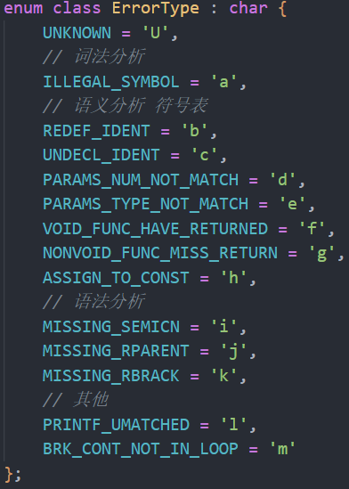

错误处理也在整个编译的不同阶段进行，如上图词法分析、语法分析、语义分析分别有可以进行的错误处理。

### 编码完成之后的修改

编码完成后之后的修改主要在于符号表中一项符号的存储结构设计。从需求上方分析，符号表中的一项需要存储类型信息、数组信息、维度信息、字面值信息、层级信息等等信息。一个单独的表项并不能很好的存储所有的这些信息，因此设计的时候我采用的是下图的结构：

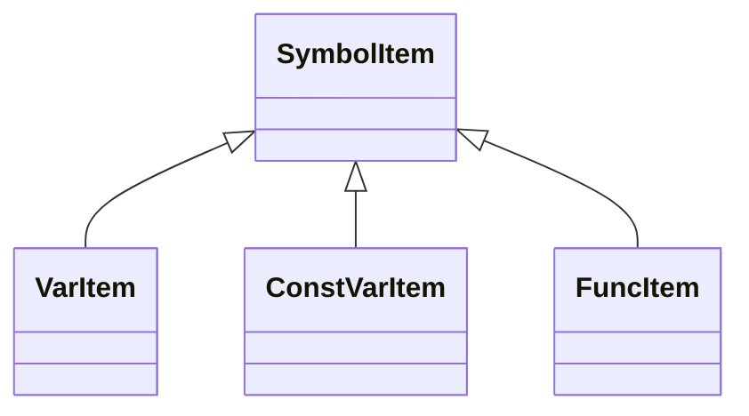

对于其中存储的类型，设计的类型结构如下

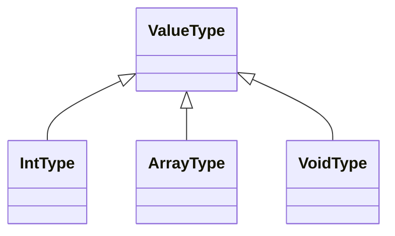

为了能够在 ArrayType 中直接存储数组定义时的初始值和维度信息，使用模板设计了`MultiFlatArray<T>`的用于存储多维数组。

## 六. 代码生成设计

### 编码前的设计

#### 中间代码生成

中间代码是从 AST 中导出 LLVM IR，为此我们需要先设计出 IR 的数据结构。IR 的数据结构需要表示指令之间的引用使用关系，因此我们设计了以下结构的 IR 数据结构：

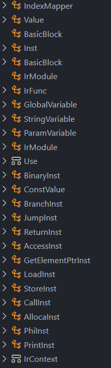

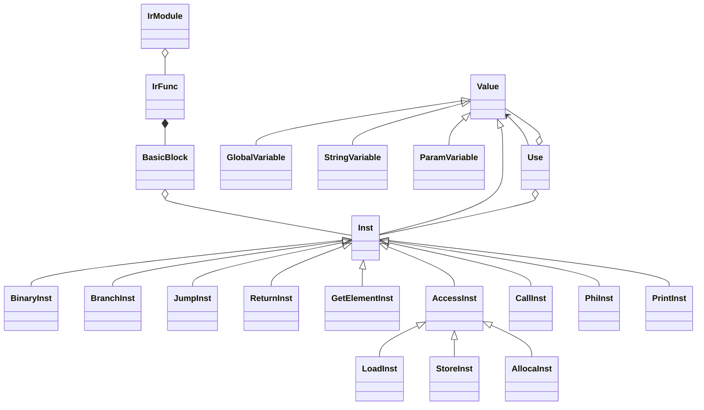

上图中的 XXXInst，除了 PrintInst，每个都代表一种 LLVM IR 的语句，在翻译到文本时，只需要重载各个 XXXInst 类的<<的运算符，我们就能输出对应的内容了。

代码生成阶段的核心发生在 Visitor 中，我们依然采用递归下降子程序法，从建好的 AST 树的根节点出发，一步一步递归到叶节点。在 IrContext 中，随着 Visitor 在 AST 中的访问，我们一直保存着 IR 结构中当前的所处的 IRModule、IRFunc 最后精确到 BasicBlock。随着 Visitor 的进行，指令将被按顺序添加到 BasicBlock 中的 Inst 动态数组中。

#### 目标代码生成

从中端生成的 LLVM IR 可以直接输出称为 LLVM 虚拟机可以直接执行的中间代码，我们也可以将其注入到后端将其一一对应地转换为 MIPS 代码。为了生成 MIPS 代码，也需要一套类似 IR 的数据结构，但是要更简单一些。

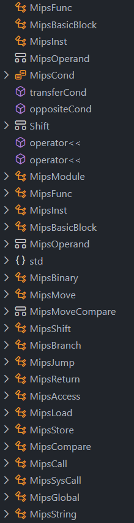

可以看到上图中，几乎所有指令都对应着 IR 中 LLVM 的指令。在这个环节需要对每个 IRModule 中的 IRFunc 中的每个 BasicBlock 中的每个 Inst 执行对应的转换，应对每种 IR 指令，分别编写一个函数来转换为上图 MIPS 代码的结构。这个过程中，每一个 IR 中的 Value，都对应一个 MipsOperand。对于每一个新的 MipsOperand 我们都为其分配一个虚拟寄存器，并存储到一个 Map 中。

虚拟寄存器可以理解为假设 CPU 中有无限的寄存器，每次有新的 MipsOperand 需求都分配一个新的即可。而至于具体物理寄存器的分配，则在下面优化环节中的图着色算法中进行分配。

### 编码完成之后的修改

并无较大的改动，不过此时错误处理的代码和中间代码生成部分代码重合在了一起，可读性下降，考虑进一步修改 Vistor 中的代码将其解耦，放入不同的文件中。

## 七. 代码优化设计

### 编码前的设计

#### mem2reg 算法

为实现这个算法需要构建支配树计算支配边界，并在支配边界节点头部插入 Phi 指令。此步骤在优化文档有详细的阐述，并不在此展开。mem2reg 算法就是将 LLVM IR 中的 alloca/store/load 等面向内存操作值的指令转变为寄存器的操作。具体的 mem2reg 算法如下：

1. 首先统计出所有上述模式的 alloca 指令，和他们所在的基本块。
2. 计算出每个基本块节点的支配边界，在支配边界的块的头部插入 Φ-node，也就是`phi`指令。
3. 变量重命名，即删除 Load 指令，把对 Load 结果的引用换成对寄存器的引用，把 Store 指令改成寄存器赋值。

#### 图着色寄存器分配算法

针对目标代码生成中生成的虚拟寄存器，这一步的目的就是为其分配具体的物理寄存器。MIPS 中可用的寄存器为\$t0~\$t9 一共 18 个寄存器可以自由使用，其余寄存器都是预留寄存器，包括栈指针寄存器、参数寄存器、返回值寄存器等等。对于这些寄存器我们执行预着色处理。具体的算法步骤如下，而其中的重点在于：

1. 画出控制流图（Conroll Flow Graph）

2. 执行活跃分析（Liveness analysis）

3. 画出寄存器干涉图（冲突图）

4. 执行图着色

5. 基于着色图分配寄存器

_•_ 构建干涉图：对于赋值特殊处理。即使右操作数在赋值语句后存活，也不用在左右操作数间连边

_•_ 对机器寄存器预着色，预着色的节点间互相不同色，着色过程中也不再分配颜色

_•_ 着色过程：选择度数小于机器寄存器数目的节点删除之，若不存在则按照启发式算法选择一个。同时尝试进行节点合并，freeze 等操作。重复直至删除完，逆序添加回去，为每个节点选择邻居都没有的颜色，若没有可用的颜色证明它需要 spill，分配完成后依据需要 spill 的节点重写程序，再分配一次。

#### 窥孔优化

窥孔优化，顾名思义就是对代码段中很小的一部分的上下文进行分析，删除一些不必要的指令。窥孔优化我们的方法中主要有三种：move 指令的优化、计算指令的优化，跳转优化和 load/Store 优化。

1. move 指令的优化：

   move 指令只有两个操作数，源和目的。一种情况是其源和目的寄存器相同，自然就是不必执行的指令；另一种情况就是相邻两条 move 指令，后一条指令的目的寄存器与前一条相同，且后一条指令的源寄存器并不是前一条指令的目的寄存器。因为这样的两条指令序列相当于后一条覆盖了前一条指令，需要删掉前一条指令。

2. 计算指令的优化。对于 add/sub 指令等，形为`add t0, t0, 0`的指令可以被省略

3. 跳转指令的优化。如 j 指令，如果其在基本块的尾部，且跳转的对象为下一个连续的基本块，则可以省略。

4. load/Store 优化。对于相邻两个 load 之后就 store，且操作地址相同，偏移量相同的指令。可以删除两条指令并用 move 指令等效替代。

#### 乘法除法优化

对于乘除法，CPU 中不在 ALU 而是专门的乘除法单元进行，往往需要数十个时钟周期才能完成。因此，使用左移右移的方法尽可能地替代也是一种优化的方法。

乘法优化：对于$2^n$的常数乘数，可以用`sll`指令，左移 n 位来替代。

除法优化：对于$2^n$的常数除数，可以用`srl`指令，右移 n 位来替代。

#### 常量传播

因为 SysY 中 const 关键词标识的常量在编译期就能确定值，因此大部分情况我们都可以在编译期将常量替换成其值参与计算。同样还有各种常量表达式，如果常量表达式中每一个操作数都可以从常量传播而来，那么常量表达式本身也可以在编译期求值。这样一来，可以传播的变量就有 const 常量、字面值和 const 数组。

不过 SysY 中存在一种情况不能直接进行常量传播，如：

```c
const int arr[2] = {1,2};
int n;
n = getint();
arr[n] = 10;
```

对于下标本身非常量的数组，就不能直接传播了。因此，单纯的在编译期代码生成阶段进行常量的值替换时不可行的。因此，本方案的做法是在每一个 exp 递归下降的子程序中，对常量进行尝试传播：如果表达式能够被传播为常量，则表达式本身将返回一个字面值的常量值；如果不能则生成对应的代码。因此，所有的常量表达式都能在代码生成期间完成常量传播。

### 编码完成之后的修改

一开始所有的优化代码都是添加在 Codegen 流程中插入的一个函数，每次想要新增一个 Pass 需要手动直接在代码流程中更改非常的不方便。因此我使用了 C++中的 functional 头文件，将函数作为可调用对象存入一个动态数组中，代码流程中就只需要写好执行 pass 的逻辑即可。在中间代码生成和目标代码生成两部的后面分别加入执行 pass 的代码。
